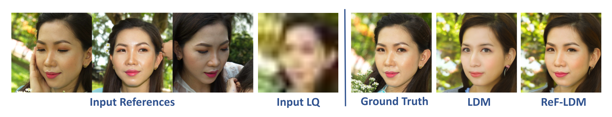

# ReF-LDM: A Latent Diffusion Model for Reference-based Face Image Restoration
**NeurIPS 2024**

[](https://chiweihsiao.github.io/refldm.github.io/)

🚩 **Updates**
- [x] Release FFHQ-Ref Dataset

🚩 **TODO**
- [ ] Release ReF-LDM model and inference script
- [ ] Clean inference script

## FFHQ-Ref Dataset
- FFHQ-Ref dataset contains 20,405 high-quality face images with corresponding reference images.
- It is constructed from the 70,000 images of [FFHQ dataset](https://github.com/NVlabs/ffhq-dataset) and the facial identity labels predicted by ArcFace.
### Prepare dataset
- Reference mapping files
   - In the csv file, each line is a target image and its reference images.
   - [train]() | [val]() | [test]()
- HQ images
  - Downloaded from [FFHQ dataset](https://github.com/NVlabs/ffhq-dataset?tab=readme-ov-file#overview) (`images1024x1024`).
- Testing LQ images
  - [severe degradation]() | [moderate degradation]()
- Identity-based FFHQ data splitting
  - Why? Previous works randomly split FFHQ dataset, causing images of the same person to be distributed across both the training and evaluation sets. To address this issue, we provide a new FFHQ data splitting based on the identity labels.
  - [train]() | [val]() | [test]()
- Additional evaluation dataset: CelebA-Test-Ref
  - [Reference mapping file]()
  - HQ images: Download from [CelebAMask-HQ](https://github.com/switchablenorms/CelebAMask-HQ?tab=readme-ov-file#celebamask-hq-dataset-downloads) (`CelebAMask-HQ/CelebA-HQ-img`)
  - Testing LQ images: [CelebA-Test]()


## ReF-LDM model
ReF-LDM leverages a flexible number of reference images to restore a low-quality face image.

**Example Result of ReF-LDM model**



**Model Overview**


### Run Inference
TODO


## Acknowledgement
- The code of ReF-LDM model is modified from [CompVis/latent-diffusion](https://github.com/CompVis/latent-diffusion).
- All images in FFHQ-Ref dataset comes from [NVlabs/ffhq-dataset](https://github.com/NVlabs/ffhq-dataset).
- We use [ArcFace model](https://drive.google.com/file/d/1N0GL-8ehw_bz2eZQWz2b0A5XBdXdxZhg/view?usp=sharing) from [deepinsight/insightface](https://github.com/deepinsight/insightface/tree/master/model_zoo) to find reference images.
- We use [dchen236/FairFace](https://github.com/dchen236/FairFace) to analyze the age, geneder, and race distribution of FFHQ-Ref dataset.


## License and Usage
This FFHQ-Ref dataset and ReF-LDM model are provided for **non-commercial research purposes only**. Any commercial use is strictly prohibited.


## Citation
```
@inproceedings{hsiao2024refldm,
  title={ReF-LDM: A Latent Diffusion Model for Reference-based Face Image Restoration},
  author={Chi-Wei Hsiao and Yu-Lun Liu and Cheng-Kun Yang and Sheng-Po Kuo and Yucheun Kevin Jou and Chia-Ping Chen},
  journal={Advances in Neural Information Processing Systems},
  year={2024}
}
```