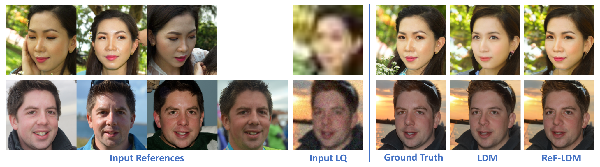
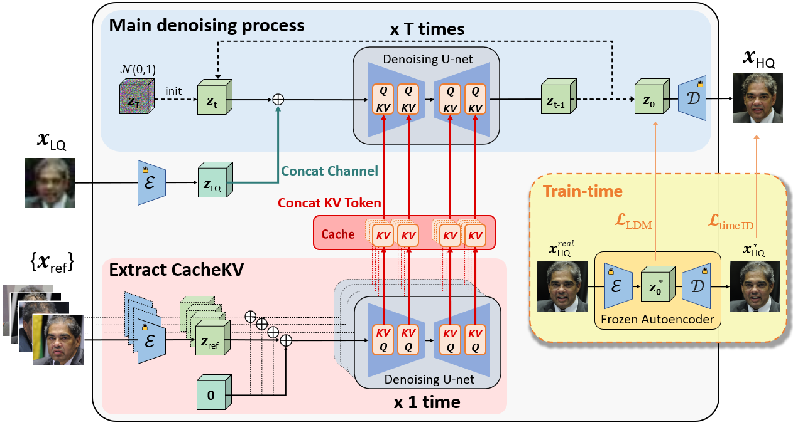

# ReF-LDM: A Latent Diffusion Model for Reference-based Face Image Restoration
**NeurIPS 2024**

[](https://chiweihsiao.github.io/refldm.github.io/)

🚩 **Updates**
- [x] Release [FFHQ-Ref Dataset](#ffhq-ref-dataset)


🚩 **TODO**
- [ ] Release [ReF-LDM model](#ref-ldm-model)
- [ ] Clean inference script

<br>


## ReF-LDM Model

ReF-LDM leverages **a flexible number of reference images** to restore a low-quality (LQ) face image into a high-quality (HQ) one.

### Visual Results



### Model Architecture



### Inference Instructions
TODO

<br>


## FFHQ-Ref Dataset

👉 [Download](https://github.com/ChiWeiHsiao/ref-ldm/releases/tag/0.1.0)

```
FFHQ-Ref/
│
├── reference_mapping/
│   ├── train_references.csv
│   ├── val_references.csv
│   └── test_references.csv
│
├── id_based_ffhq_split/
│   ├── train_image.txt
│   ├── val_image.txt
│   └── test_image.txt
│
└── test_images/
    ├── severe_degrad/
    └── moderate_degrad/
```

### Dataset Contents

#### FFHQ-Ref Dataset
FFHQ-Ref contains 20,405 high-quality face images with corresponding reference images.
It is constructed from the 70,000 images of the FFHQ dataset using facial identity labels predicted by ArcFace.

- High-quality images
  - Download from [FFHQ dataset](https://github.com/NVlabs/ffhq-dataset?tab=readme-ov-file#overview) (`images1024x1024/`)
- `reference_mapping/`
  - CSV files that list target images and their corresponding reference images
- `id_based_ffhq_split/`
  - Text files that list images for identity-based train/val/test splits of FFHQ dataset (70,000 images)
  - Why is this needed? Previous works randomly split the FFHQ dataset, which resulted in images of the same person being distributed across both training and evaluation sets. We provide identity-based data splits to address this issue.
- `test_images/`
  - Low-quality test images with two degradation levels

#### CelebA-Test-Ref Dataset
An additional testing dataset for reference-based face restoration, containing 2,533 images with corresponding reference images.

- High-quality images
  - Download from [CelebAMask-HQ](https://github.com/switchablenorms/CelebAMask-HQ?tab=readme-ov-file#celebamask-hq-dataset-downloads) (`CelebAMask-HQ/CelebA-HQ-img/`)
- `test_references.csv`
  - Lists target images and their corresponding reference images
- `celeba_test_images/`
  - Contains low-quality test images and high-quality ground truth images

<br>


## Acknowledgments
- The code of ReF-LDM model is modified from [CompVis/latent-diffusion](https://github.com/CompVis/latent-diffusion).
- All images in the FFHQ-Ref dataset come from [NVlabs/ffhq-dataset](https://github.com/NVlabs/ffhq-dataset).
- We used the [ArcFace model](https://drive.google.com/file/d/1N0GL-8ehw_bz2eZQWz2b0A5XBdXdXzHg/view?usp=sharing) from [deepinsight/insightface](https://github.com/deepinsight/insightface/tree/master/model_zoo) to find reference images.
- We used [dchen236/FairFace](https://github.com/dchen236/FairFace) to analyze the age, gender, and race distribution of the FFHQ-Ref dataset.

## License and Usage
The FFHQ-Ref dataset and ReF-LDM model are provided for **non-commercial research purposes only**. Any commercial use is strictly prohibited.

## Citation
```
@inproceedings{hsiao2024refldm,
  title={ReF-LDM: A Latent Diffusion Model for Reference-based Face Image Restoration},
  author={Chi-Wei Hsiao and Yu-Lun Liu and Cheng-Kun Yang and Sheng-Po Kuo and Yucheun Kevin Jou and Chia-Ping Chen},
  journal={Advances in Neural Information Processing Systems},
  year={2024}
}
```