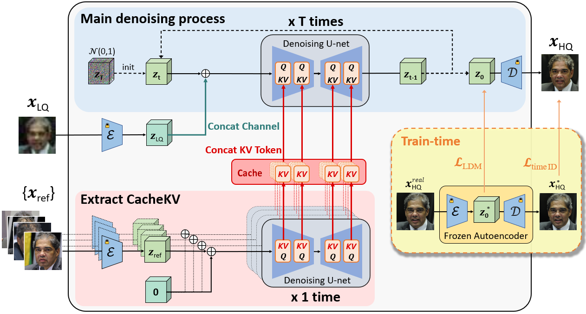

# ReF-LDM: A Latent Diffusion Model for Reference-based Face Image Restoration
**NeurIPS 2024**

[](https://chiweihsiao.github.io/refldm.github.io/)

🚀 We will release our dataset and model soon!! 


### Overview
ReF-LDM leverages a flexible number of reference images within an LDM.
<p align="center">
    
</p>


## Citation
```
@inproceedings{hsiao2024refldm,
  title={ReF-LDM: A Latent Diffusion Model for Reference-based Face Image Restoration},
  author={Chi-Wei Hsiao and Yu-Lun Liu and Cheng-Kun Yang and Sheng-Po Kuo and Yucheun Kevin Jou and Chia-Ping Chen},
  journal={Advances in Neural Information Processing Systems},
  year={2024}
}
```
